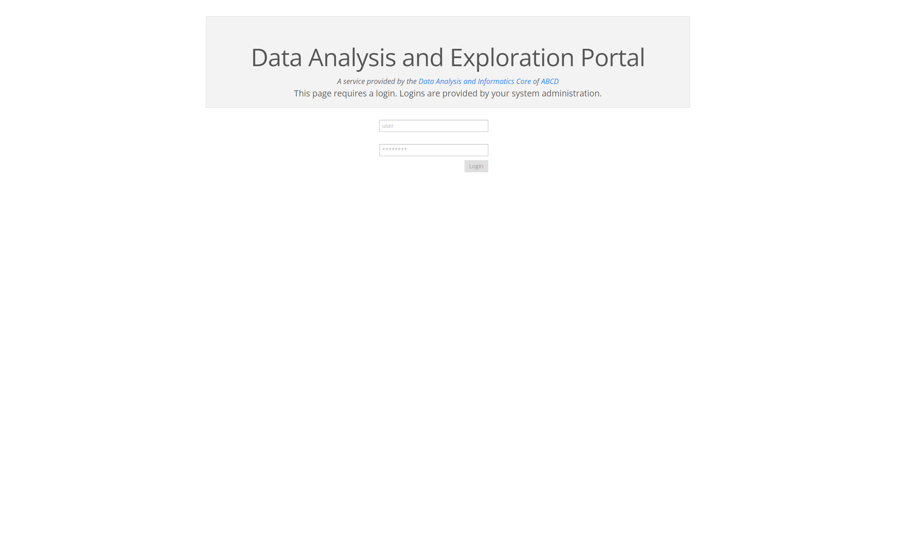
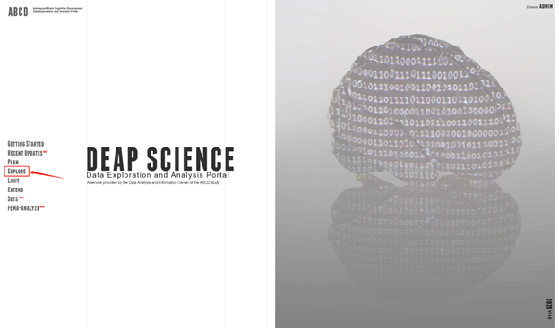
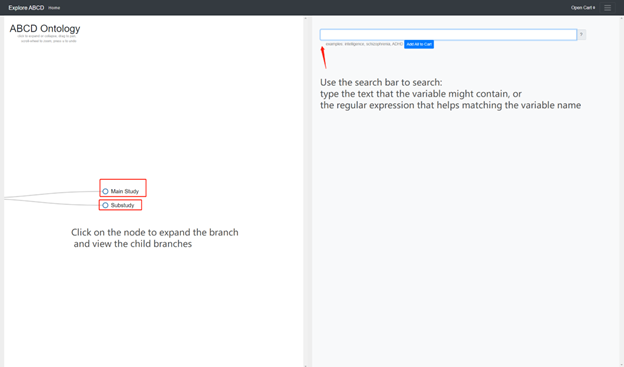
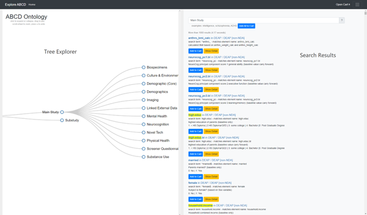
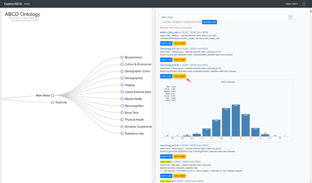
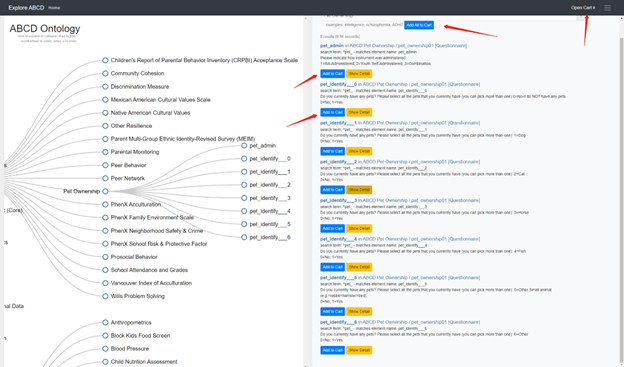
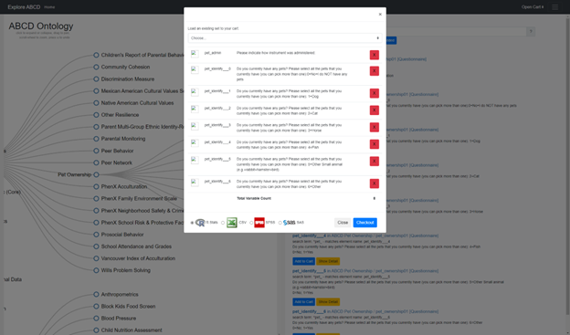

# ABCD DEAP GUI

## Overview

The DEAP platform is a web-based tool supported by NDA that offers users a centralized and user-friendly interface for exploring and analyzing the ABCD data. Its goal is to simplify the data analysis process by allowing users to easily access and process large amounts of data in various formats. The platform is equipped with a variety of data visualization tools and statistical algorithms. A version of the ABCD DEAP is available at https://abcd-deap.ucsd.edu, and this documentation is intended to give an overview of the interface and functionality provided by DEAP.

## Key Features

* Ontology Explorer
  * Users are able to explore the data dictionary and download the data of the ABCD in the "EXPLORE" page.

## **Registration and Login**

An account is required to access the functionalities of DEAP and can be registered and created upon request. If password is forgotten or having login issue, please first try clearing the local cache and then contact the IT support.

<figure><figcaption></figcaption></figure>

## Navigation and Layout

All pages and main functionalities are accessible from the menu of the home page of DEAP. The pages include updates, explore, and anlyaze, etc, which will be discussed in detail in the following section. The logout button is available in the top-right corner by mouse-hovering over the username display. If there is no user activity for a period of the time, the session will expire and login is required to log back into the website.

## Functionality and Interactions

The 'Getting Started' page provides a detailed overview of each module. This section will focus exclusively on navigating and using the 'Explore' page.

From the main page, click on ‘EXPLORE’ to go into the ontology explore page

<figure><figcaption></figcaption></figure>

Once the explore page is fully loaded:\

<figure><figcaption></figcaption></figure>

For example, various child nodes were revealed after clicking the main study node. On the right side of the screen is the section for search results corresponding to the node. If continue following down a branch, variables will be further narrowed down.&#x20;

<figure><figcaption></figcaption></figure>

'Show Detail’ button reveals the distribution of data in either histogram or other information depending on the data type.

<figure><figcaption></figcaption></figure>

For data downloading, use ‘add to cart’ or ‘add all to cart’ button to either add a single variable or add all variables from the search results section into the cart, which is accessible from the ‘open cart’ button on the top-right corner of the page.

<figure><figcaption></figcaption></figure>

Once added, open the cart to download the data in desired format.&#x20;

<figure><figcaption></figcaption></figure>

## Updates and Version History

The website will make regular updates. Details about each updates are available at 'Recent Updates' page, which include updated components, known issues, and future plans. Please feel free to report any undocumented bugs and issues.
